# Blog Weekly Nerd
## Introduction
During the minor Everything Web I followed, a developer visited us every Tuesday and had a talk about a particular subject. Sketch notes for every talk should then be collected in a blog. Out of all the talks 5 subjects were to be selected to write an article about.

In this repo all sketch notes (some are Dutch) are viewable along with the 5 written articles. At the end of this read me you can find links to these articles.

## The topics i will be discussing
1. [Why it isn't the end of the world if you use div's every now and then](https://github.com/ChanelZM/blog-weekly-nerd/blob/master/usingdivs.md)
2. [An Introduction to Dev Tools](https://github.com/ChanelZM/blog-weekly-nerd/blob/master/devtools.md)
3. [Designer, learn to code (a little bit)](https://github.com/ChanelZM/blog-weekly-nerd/blob/master/designcode.md)
4. [A more detailed look at Web Animation API](https://github.com/ChanelZM/blog-weekly-nerd/blob/master/webanim.md)
5. [Getting to know Git more (undoing changes)](https://github.com/ChanelZM/blog-weekly-nerd/blob/master/git.md)

## Week 1
The first week Stephen Hay, designer and developer at CataWiki, had a question & answer.

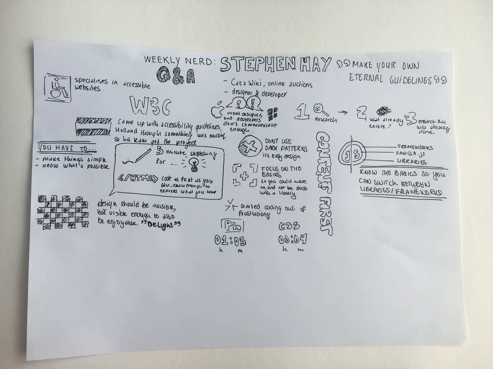

## Week 2
The second week developer Justus Sturkenboom had a talk about sketch noting, how to this and why it's so important.

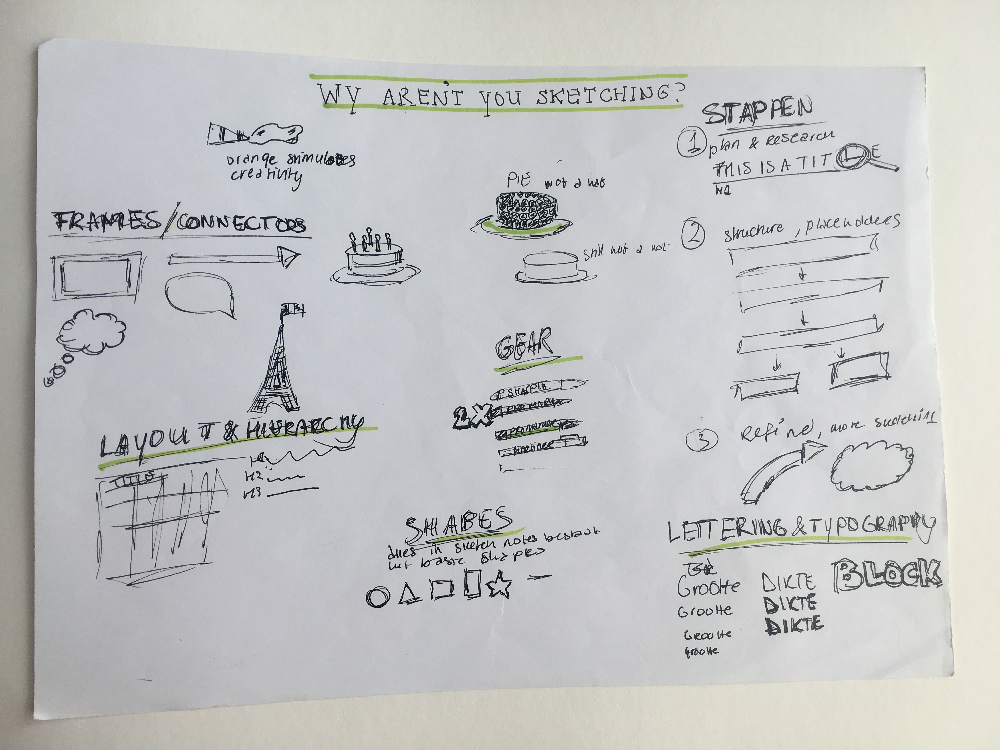

## Week 3
This week Peter Paul Koch visited us and talked about four, possibly five, problems he notices regularly with Webdevelopers in particular.

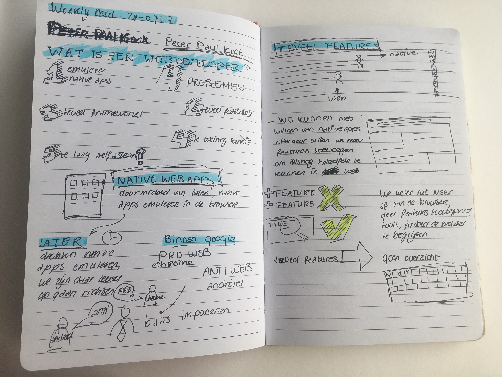
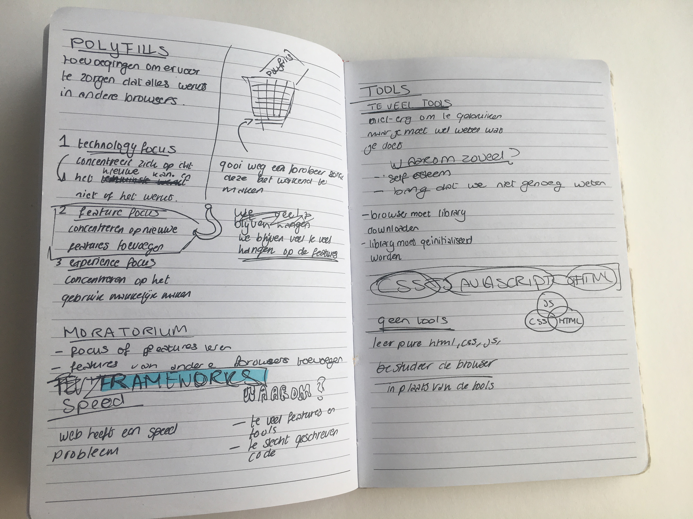

## Week 4
The third week Titus Wormer gave us more information about using Git and GitHub along with a little bit of code history.

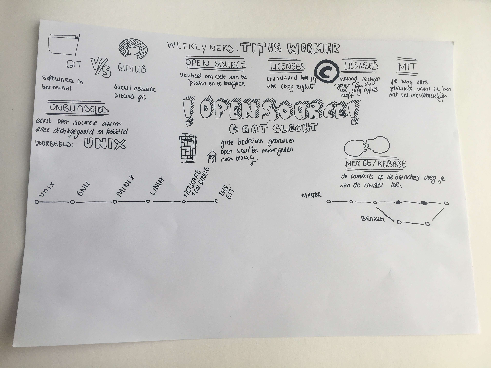

## Week 5
The fifth week we visited Voorhoede, a front-end developers company, and Jasper Moelker gave us a talk about making the web more fun.

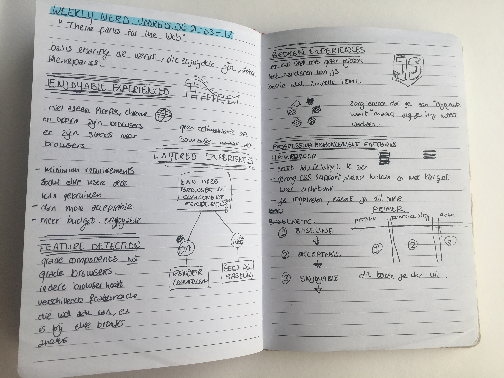

## Week 6
The sixth week, the most interesting talker yet, Bram Duvigneau, a blind developer, gave us a talk about how accessible the web is for people who use screenreaders.

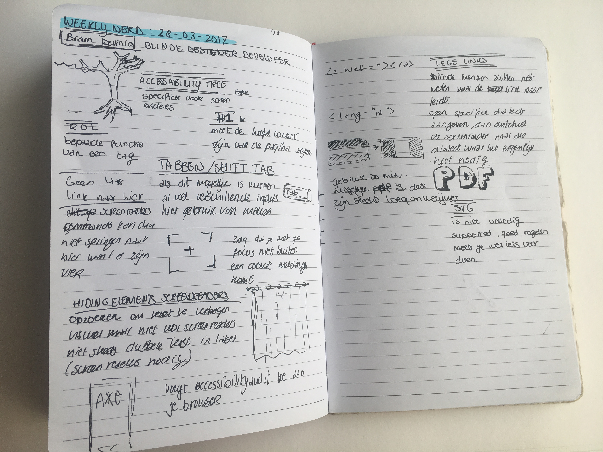

## Week 7
This week a speaker, who's name I forgot, talked about his creations made with IoT devices.

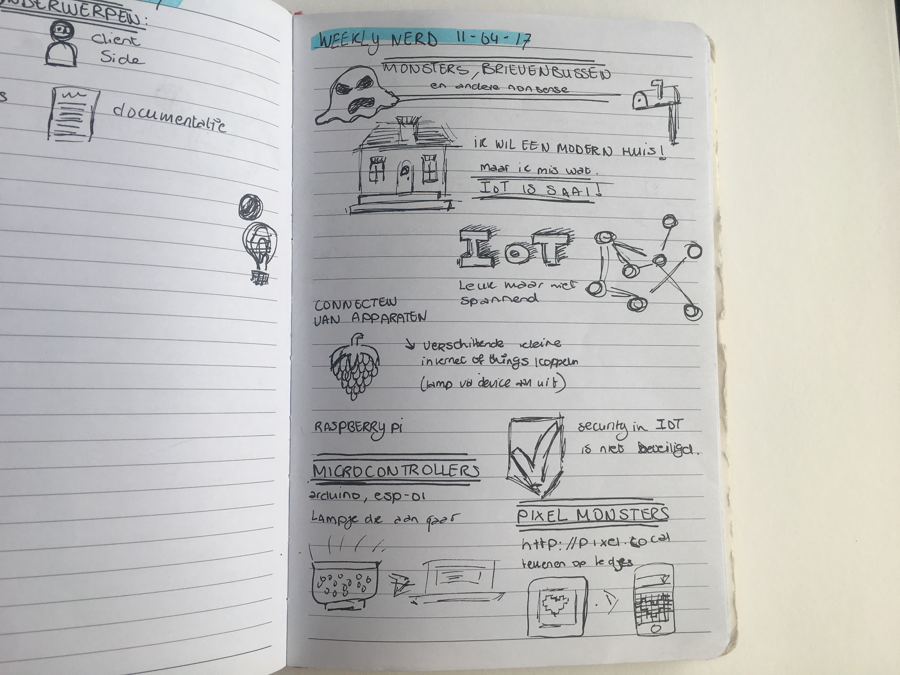
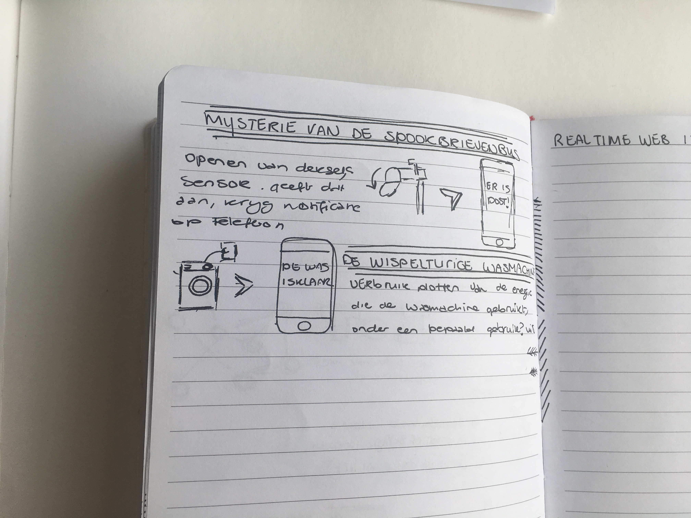

## Week 8
Peter Peerdeman, a Lifely front-end developer, gave this weeks talk and lectured about Real Time Web and GraphQL.

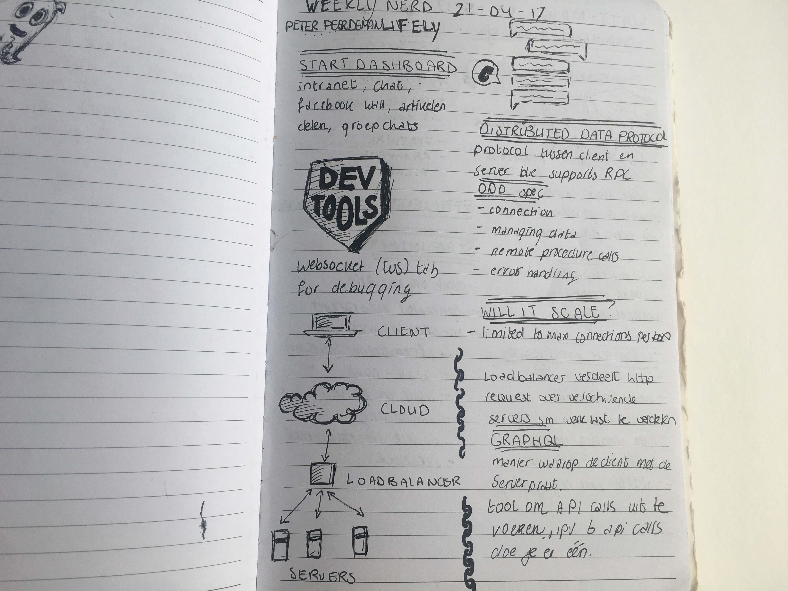

## Week 9 & 10
The ninth week one of the founders of Lifely, Nick de Bruijn, talked about setting up his own company and how to do this.

The tenth week Guido Bauman from Q42 talked about IoT in their company and the future of it.

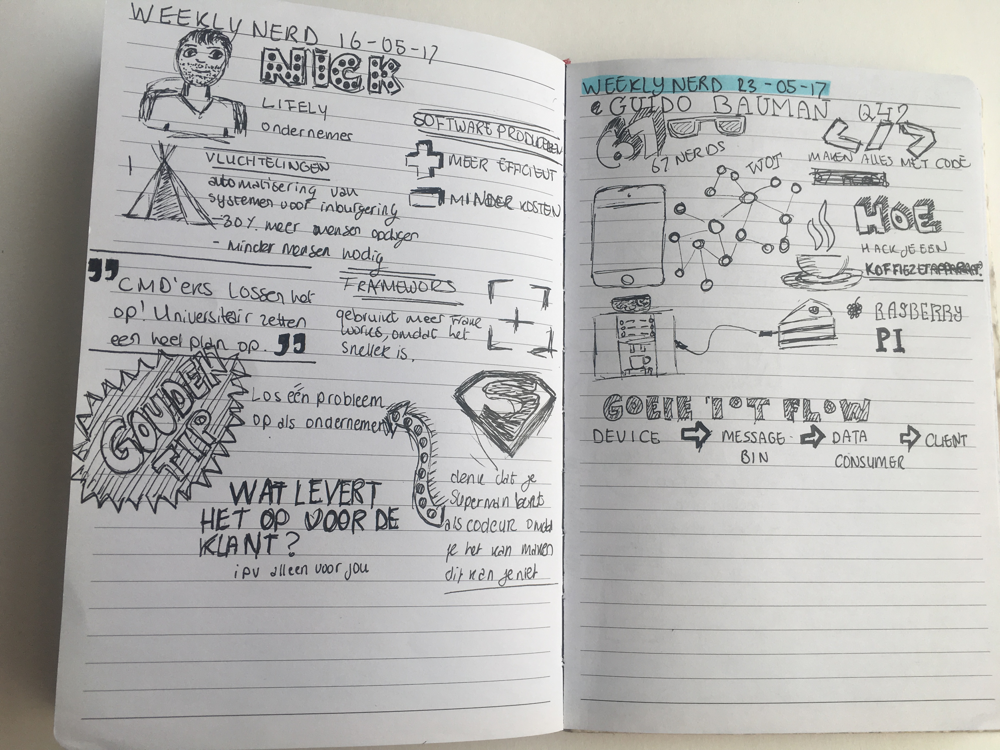

## Week 11
This week another blind developer visited the HvA, Leonie Wattson, and talked about five things you should know about screenreaders.

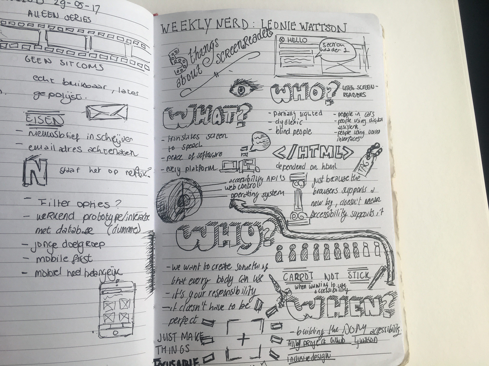

## CSS day
Coming soon

- *IoT and security*
- *GraphQL*
- *Why a designer should know a little bit of code*
