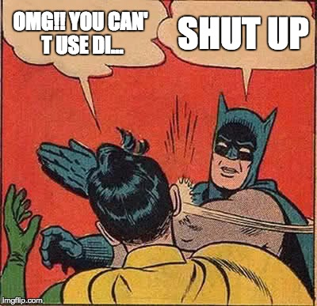

# Why it isn't the end of the world if you're using divs every now and then

There are those that use div's everywhere and for every little thing and there are those that condemn div's and think people should be heavily punished for using this element (I love exaggerating). This 'war' about using div's has been waging on for years. I especially have been in contact with people that do not except div as a semantic element and I must say I partially agree with them (Huh?).

Now before I start telling everybody about why I think occasionally using div's isn't a big problem and getting hated on let me just say a few things here:
1. **I am not pro-div.** So don't use this article to justify every div you write, because I *did* say that using div's *occasionally* is okay.
2. **Yes, I'm well aware that div's don't have any semantic meaning**, thus it won't do anything for accessibility. That's why you should be cautious with it.
3. **Yes, I do care about semantic HTML**. I barely use div's myself. Things like `<section>` or `article` are better to use most cases.

With that said, I won't keep you waiting much longer and I will explain why people won't have to eliminate div's completely.

## Article and section aren't fully supported in Internet Explorer
If you've done some user research and you've discovered that a great deal of your visitors still use older versions of Internet Explorer then my condolences to you. Article and section are not supported until IE9 and after that it's only partially supported (Can I use, no date).

Fixing it with CSS won't always do the trick. Both elements cannot be used on IE8 or below and you can't fix it with CSS because the elements are simply unknown and IE will not allow styling. With IE9 and higher you are in luck because `display: block` on these elements will make sure that the element at least looks like it's supposed to.

We'll just have to wait for the moment that people will stop using Internet Explorer.

## Sometimes using article/section isn't semantically correct either
If you still think you **always** need to use articles and sections, take this into consideration:

**Meaning of `<section>`:**
> The HTML `<section>` element represents a standalone section of functionality contained within an HTML document, typically with a heading, which doesn't have a more specific semantic element to represent it.
>
*- Mozilla Developer Network, April 17, 2017*

To use the section element I must add a heading to make my HTML semantically correct again. What if that isn't necessary because the parent is a section and already has it's own heading that covers the child elements? I could add a heading and then remove it with CSS, but I think we can all agree that that's not a really good solution either. Sometimes you don't have a header to add plus the content you want to group isn't really a section so that element isn't useful in this case.

**Meaning of `<article>`:**
> The HTML `<article>` element represents a self-contained composition in a document, page, application, or site, which is intended to be independently distributable or reusable.
>
*- Mozilla Developer Network, February 1, 2017*

To use the article element the content has to be standalone. It's simple, the content that needs wrapping isn't always standalone so using an article in this case isn't semantically correct either.

Article and section are awesome elements that really solved a great deal of problems, but it still doesn't cover everything. Div's are still needed.

## Sometimes you just want to group something
At times you don't want to give the items semantic meaning, you just want to group them for layout purposes, like centering content and giving the parent a different background color. Using an article or section for that purpose wouldn't be correct. Using div is not perfect but it suits best in this situation.

> Divs should only be used to build structure and as placeholders for design elements when no other block-level elements can describe the content. The div tag is for logical groupings of elements.
>
*-Geir Wavik, April 8th 2009*

## Grouping can't be done with CSS
For those of you that would say: "If you want to do something about the layout, you should do it with CSS", I have a reply: **You can't group HTML elements with CSS**. You could try to work your way around it by adding same styling to elements next to each other, but that doesn't work for my previous mentioned example about centering. I've searched the internet for a solution but haven't found one so far. If CSS does come out with grouping elements for layout purposes, I'll be the first one to use it. For now grouping has to be done with div's.

## In short
Using articles and sections for everything isn't recommended because it isn't supported in all browsers and even if it was it still wouldn't be semantically correct to use article and section for every grouping problem because sometimes items need to be grouped for styling but don't need to be semantically correct. Unfortunately we can't look to CSS for this problem so for know, in my opinion, it's okay to occasionally use a div.

## Sources
1. Mozilla Developer Network. (April 17, 2017). *`<section>`*. Source:
https://developer.mozilla.org/en-US/docs/Web/HTML/Element/section
2. Mozilla Developer Network. (February 1, 2017). *`<article>`*. Source:
https://developer.mozilla.org/en-US/docs/Web/HTML/Element/article
3. Can I Use. (no date). *New semantic elements*. Source:
http://caniuse.com/#search=section
4. Wavik, G. (April 8, 2009). *Table layouts vs. Div Layouts: From Hell to... Hell?*. Source:
https://www.smashingmagazine.com/2009/04/from-table-hell-to-div-hell/
