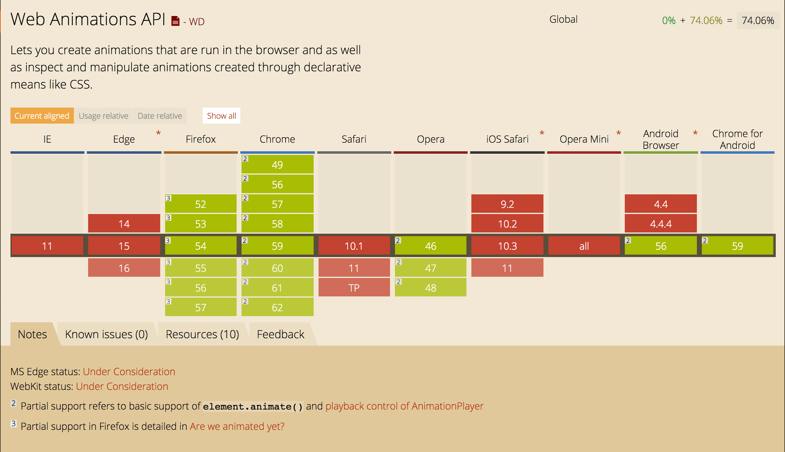

## A more detailed look at Web Animations API
On June 15th, 2017, a beautiful warm day, I was one of the sixteen students of the HvA that attended CSS Day. It was a wonderful learning experience, a conference I hope to attend again in the future. The very first speaker was Rachel Nabors and she talked about the Web Animations API (WAAPI), a JavaScript API that's specially made for animations. After the talk I was absolutely amazed by the API and I wanted to take a closer look at it.

## Browser Support

*Image 1: Nooooo, pleaseee I want to use it*

First of all, let's start with browser support. When I looked up Web Animations API on caniuse.com, I cried a little because normal browsers don't fully support it yet. So you can't really use WAAPI yet for production or you could but as a progressive enhancement. For now it's fun to play with in your free time and here's why.

## Why you should try it
Besides the obvious reason that learning new features is always an advantage (not trying to be SASSy, phun intended), there are of course other reasons why you should try this amazing new feature.

The first reason is quite self-evident, according to Rachel Nabors: **"You can do so much more animations with Web Animations API"**, because why else would you create an API if it does exactly the same thing (sounding SASSy again). For example: you can now save your animations in a variable and use them again later on (Pawel Grzybek, May 18th, 2017). Bringing animations to JavaScript will result in more DRY code.

Another reason to use this API is: you don't have to load an external library anymore to do animations (and using an extra http call), because with WAAPI, animations can now be done with native JavaScript (Danny Markov, May 16th, 2017).

WAAPI's sequencing is also very easy and legible (Sarah Drasner, May 2nd, 2016). It doesn't take a lot of code to create an animation.

Last be not least, the API is high-performance (Pawel Grzybek, May 18th, 2017)! Fast Webpages for the win!

## The Downside
As I mentioned earlier, browser support isn't that great so some of your users will not see the animations you've created. If you do want to use WAAPI there is a reliable [polyfill](https://github.com/web-animations/web-animations-js) for Chrome, Firefox 27+, IE10+ and Edge, iOS Safari 7.1+ and Mac Safari 9+(Pawel Grzybek, May 18th, 2017). So use the polyfill or just wait a little longer.

Another downside has nothing to do with the API itself but with JavaScript. JavaScript sometimes fails to do its work, some people don't have JavaScript turned on and some people just don't have a strong internet connection to load the script (Stuart Langridge). There are many more reasons as to why JavaScript possibly won't work and that's when your animations won't work either. CSS has better support so doing your animations in CSS has a larger success rate of executing than doing animations in JavaScript.

## Conclusion
WAAPI is a very handy feature and comes with some great advantages like high performance, no external library and more animation possibilities, but browser support isn't great yet, plus there are enough reasons why JavaScript can fail while loading a webpage. My advice is to use it with caution. Play with it but don't depend on it when creating a website.

## Sources
1. Langridge, S. (no date). *Everybody has JavaScript right?* Source:
https://kryogenix.org/code/browser/everyonehasjs.html
2. Markov, D. (May 16th, 2017). *Getting Started with the JavaScript Web Animations API*. Source:
https://tutorialzine.com/2017/05/getting-started-with-the-javascript-web-animation-api
3. Grzybek, P. (May 18th, 2017). *Intro to the Web Animations API*. Source:
https://pawelgrzybek.com/intro-to-the-web-animations-api/
4. Drasner, S. (May 2nd, 2016). *A Comparison of Animation Technologies*. Source:
https://css-tricks.com/comparison-animation-technologies/
